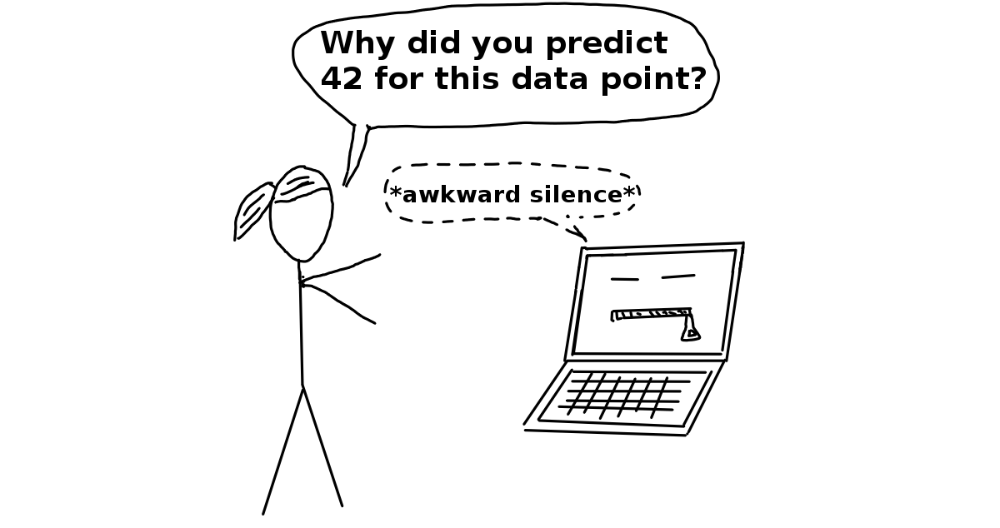

--- 
title: "A Minimal Book Example"
author: "Yihui Xie"
date: "`r Sys.Date()`"
site: bookdown::bookdown_site
documentclass: book
bibliography: [book.bib, packages.bib]
biblio-style: apalike
link-citations: yes
description: "This is a minimal example of using the bookdown package to write a book. The output format for this example is bookdown::gitbook."
---

# Prerequisites

This is a _sample_ book written in **Markdown**. You can use anything that Pandoc's Markdown supports, e.g., a math equation $a^2 + b^2 = c^2$.

The **bookdown** package can be installed from CRAN or Github:

```{r eval=FALSE}
install.packages("bookdown")
# or the development version
# devtools::install_github("rstudio/bookdown")
```

Remember each Rmd file contains one and only one chapter, and a chapter is defined by the first-level heading `#`.

To compile this example to PDF, you need XeLaTeX. You are recommended to install TinyTeX (which includes XeLaTeX): <https://yihui.name/tinytex/>.

```{r include=FALSE}
# automatically create a bib database for R packages
knitr::write_bib(c(
  .packages(), 'bookdown', 'knitr', 'rmarkdown'
), 'packages.bib')
```

<!--chapter:end:index.Rmd-->

```{r setup, cache=FALSE, include=FALSE}
#devtools::load_all()
#is.html = !is.null(output) && output == "html"
```


# Preface {-}
```{r cover, cache=FALSE, out.width=500, fig.align="center"}
knitr::include_graphics('images/title_page.jpg', dpi = NA)
```

Machine learning has great potential for improving products, processes and research. 
But **computers usually do not explain their predictions** which is a barrier to the adoption of machine learning. 
This book is about making machine learning models and their decisions interpretable.

After exploring the concepts of interpretability, you will learn about simple, **interpretable models** such as decision trees, decision rules and linear regression.
Later chapters focus on general model-agnostic methods for **interpreting black box models** like feature importance and accumulated local effects and explaining individual predictions with Shapley values and LIME.

All interpretation methods are explained in depth and discussed critically.
How do they work under the hood?
What are their strengths and weaknesses?
How can their outputs be interpreted?
This book will enable you to select and correctly apply the interpretation method that is most suitable for your machine learning project.

The book focuses on machine learning models for tabular data (also called relational or structured data) and less on computer vision and natural language processing tasks.
Reading the book is recommended for machine learning practitioners, data scientists, statisticians, and anyone else interested in making machine learning models interpretable.


**About me:** My name is Christoph Molnar, I'm a statistician and a machine learner.
My goal is to make machine learning interpretable.
If you are interested in improving the interpretability of your machine learning models, do not hesitate to contact me!

Mail: christoph.molnar.ai@gmail.com

Website: [https://christophm.github.io/](https://christophm.github.io/)

Follow me on Twitter! [\@ChristophMolnar](https://twitter.com/ChristophMolnar)

Cover by [\@YvonneDoinel](https://twitter.com/YvonneDoinel)


<!--chapter:end:00.0-preface.Rmd-->

# Introduction {#intro}

This book explains to you how to make (supervised) machine learning models interpretable.
The chapters contain some mathematical formulas, but you should be able to understand the ideas behind the methods even without the formulas.
This book is not for people trying to learn machine learning from scratch.
If you are new to machine learning, there are a lot of books and other resources to learn the basics.
I recommend the book "The Elements of Statistical Learning" by Hastie, Tibshirani, and Friedman (2009) [^Hastie] and [Andrew Ng's "Machine Learning" online course](https://www.coursera.org/learn/machine-learning)  on the online learning platform  coursera.com to start with machine learning.
Both the book and the course are available free of charge!

New methods for the interpretation of machine learning models are published at breakneck speed.
To keep up with everything that is published would be madness and simply impossible. 
That is why you will not find the most novel and fancy methods in this book, but established methods and basic concepts of machine learning interpretability.
These basics prepare you for making machine learning models interpretable.
Internalizing the basic concepts also empowers you to better understand and evaluate any new paper on interpretability published on [arxiv.org](https://arxiv.org/) in the last 5 minutes since you began reading this book (I might be exaggerating the publication rate).

This book starts with some (dystopian) [short stories](#storytime) that are not needed to understand the book, but hopefully will entertain and make you think.
Then the book explores the concepts of [machine learning interpretability](#interpretability).
We will discuss when interpretability is important and what different types of explanations there are.
Terms used throughout the book can be looked up in the [Terminology chapter](#terminology).
Most of the models and methods explained are presented using real data examples which are described in the [Data chapter](#data).
One way to make machine learning interpretable is to use [interpretable models](#simple), such as linear models or decision trees.
The other option is the use of [model-agnostic interpretation tools](#agnostic) that can be applied to any supervised machine learning model.
The Model-Agnostic Methods chapter deals with methods such as partial dependence plots and permutation feature importance.
Model-agnostic methods work by changing the input of the machine learning model and measuring changes in the prediction output.
Model-agnostic methods that return data instances as explanations are discussed in the chapter [Example Based Explanations](#example-based).
All model-agnostic methods can be further differentiated based on whether they explain global model behavior across all data instances or individual predictions.
The following methods explain the overall behavior of the model: [Partial Dependence Plots](#pdp), [Accumulated Local Effects](#ale), [Feature Interaction](#interaction), [Feature Importance](#feature-importance), [Global Surrogate Models](#global) and [Prototypes and Criticisms](#proto).
To explain individual predictions we have [Local Surrogate Models](#lime), [Shapley Value Explanations](#shapley), [Counterfactual Explanations](#counterfactual) (and closely related: [Adversarial Examples](#adversarial)). 
Some methods can be used to explain both aspects of global model behavior and individual predictions: [Individual Conditional Expectation](#ice) and [Influential Instances](#influential).

The book ends with an optimistic outlook on what [the future of interpretable machine learning](#future) might look like.

You can either read the book from beginning to end or jump directly to the methods that interest you.

I hope you will enjoy the read!

[^Hastie]: Friedman, Jerome, Trevor Hastie, and Robert Tibshirani. "The elements of statistical learning". www.web.stanford.edu/~hastie/ElemStatLearn/  (2009).

<!--chapter:end:01-introduction.Rmd-->


<!--{pagebreak}-->

## Story Time {#storytime}

We will start with some short stories.
Each story is an admittedly exaggerated call for interpretable machine learning.
If you are in a hurry, you can skip the stories.
If you want to be entertained and (de-)motivated, read on!

The format is inspired by Jack Clark's Tech Tales in his [Import AI Newsletter](https://jack-clark.net/).
If you like this kind of stories or if you are interested in AI, I recommend that you sign up.

### Lightning Never Strikes Twice {-}
**2030: A medical lab in Switzerland**

```{r hospital, echo = FALSE, fig.cap = "",width=500}

```


"It's definitely not the worst way to die!" Tom summarised, trying to find something positive in the tragedy.
He removed the pump from the intravenous pole.   
"He just died for the wrong reasons," Lena added.  
"And certainly with the wrong morphine pump!
Just creating more work for us!" Tom complained while unscrewing the back plate of the pump.
After removing all the screws, he lifted the plate and put it aside.
He plugged a cable into the diagnostic port.   
"You didn't just complain about having a job, did you?" Lena gave him a mocking smile.  
"Of course not. Never!" he exclaimed with a sarcastic undertone.

He booted the pump's computer.  
Lena plugged the other end of the cable into her tablet.
"All right, diagnostics are running," she announced.
"I am really curious about what went wrong."  
"It certainly shot our John Doe into Nirvana.
That high concentration of this morphine stuff.
Man. I mean ... that's a first, right?
Normally a broken pump gives off too little of the sweet stuff or nothing at all.
But never, you know, like that crazy shot," Tom explained.  
"I know. You don't have to convince me ... Hey, look at that." Lena held up her tablet.
"Do you see this peak here? That's the potency of the painkillers mix.
Look! This line shows the reference level.
The poor guy had a mixture of painkillers in his blood system that could kill him 17 times over.
Injected by our pump here.
And here ..." she swiped, "here you can see the moment of the patient's demise."  
"So, any idea what happened, boss?" Tom asked his supervisor.  
"Hm ... The sensors seem to be fine.
Heart rate, oxygen levels, glucose, ... The data were collected as expected.
Some missing values in the blood oxygen data, but that's not unusual.
Look here.
The sensors have also detected the patient's slowing heart rate and extremely low cortisol levels caused by the morphine derivate and other pain blocking agents."
She continued to swipe through the diagnostics report.  
Tom stared captivated at the screen.
It was his first investigation of a real device failure.

"Ok, here is our first piece of the puzzle.
The system failed to send a warning to the hospital's communication channel.
The warning was triggered, but rejected at protocol level.
It could be our fault, but it could also be the fault of the hospital.
Please send the logs over to the IT team," Lena told Tom.  
Tom nodded with his eyes still fixed on the screen.  
Lena continued:
"It's odd.
The warning should also have caused the pump to shut down.
But it obviously failed to do so.
That must be a bug.
Something the quality team missed.
Something really bad.
Maybe it's related to the protocol issue."  
"So, the emergency system of the pump somehow broke down, but why did the pump go full bananas and inject so much painkiller into John Doe?" Tom wondered.  
"Good question.
You are right.
Protocol emergency failure aside, the pump shouldn't have administered that amount of medication at all.
The algorithm should have stopped much earlier on its own, given the low level of cortisol and other warning signs," Lena explained.  
"Maybe some bad luck, like a one in a million thing, like being hit by a lightning?" Tom asked her.  
"No, Tom.
If you had read the documentation I sent you, you would have known that the pump was first trained in animal experiments, then later on humans, to learn to inject the perfect amount of painkillers based on the sensory input.
The algorithm of the pump might be opaque and complex, but it's not random.
That means that in the same situation the pump would behave exactly the same way again.
Our patient would die again.
A combination or undesired interaction of the sensory inputs must have triggered the erroneous behavior of the pump.
That is why we have to dig deeper and find out what happened here," Lena explained.

"I see ...," Tom replied, lost in thought.
"Wasn't the patient going to die soon anyway? Because of cancer or something?"  
Lena nodded while she read the analysis report.  
Tom got up and went to the window.
He looked outside, his eyes fixed on a point in the distance.
"Maybe the machine did him a favor, you know, in freeing him from the pain.
No more suffering.
Maybe it just did the right thing.
Like a lightning, but, you know, a good one. 
I mean like the lottery, but not random. 
But for a reason.
If I were the pump, I would have done the same."  
She finally lifted her head and looked at him.  
He kept looking at something outside.  
Both were silent for a few moments.   
Lena lowered her head again and continued the analysis.
"No, Tom. It's a bug... Just a damn bug."

### Trust Fall {-}

**2050: A subway station in Singapore**

```{r access-denied, echo = FALSE, fig.cap = "", width=500}
knitr::include_graphics("images/access-denied.jpg")
```

She rushed to the Bishan subway station.
With her thoughts she was already at work.
The tests for the new neural architecture should be completed by now.
She led the redesign of the government's "Tax Affinity Prediction System for Individual Entities", which predicts whether a person will hide money from the tax office.
Her team has come up with an elegant piece of engineering.
If successful, the system would not only serve the tax office, but also feed into other systems such as the counter-terrorism alarm system and the commercial registry.
One day, the government could even integrate the predictions into the Civic Trust Score.
The Civic Trust Score estimates how trustworthy a person is. 
The estimate affects every part of your daily life, such as getting a loan or how long you have to wait for a new passport.
As she descended the escalator, she imagined how an integration of her team's system into the Civic Trust Score System might look like.

She routinely wiped her hand over the RFID reader without reducing her walking speed.
Her mind was occupied, but a dissonance of sensory expectations and reality rang alarm bells in her brain.

Too late.

Nose first she ran into the subway entrance gate and fell with her butt first to the ground.
The door was supposed to open, ... but it did not.
Dumbfounded, she stood up and looked at the screen next to the gate.
"Please try another time," suggested a friendly looking smiley on the screen.
A person passed by and, ignoring her, wiped his hand over the reader.
The door opened and he went through.
The door closed again.
She wiped her nose.
It hurt, but at least it did not bleed.
She tried to open the door, but was rejected again.
It was strange.
Maybe her public transport account did not have sufficient tokens.
She looked at her smartwatch to check the account balance.

"Login denied. Please contact your Citizens Advice Bureau!" her watch informed her.

A feeling of nausea hit her like a fist to the stomach.
She suspected what had happened.
To confirm her theory, she started the mobile game "Sniper Guild", an ego shooter.
The app was directly closed again automatically, which confirmed her theory.
She became dizzy and sat down on the floor again.

There was only one possible explanation:
Her Civic Trust Score had dropped. 
Substantially.
A small drop meant minor inconveniences, such as not getting first class flights or having to wait a little longer for official documents.
A low trust score was rare and meant that you were classified as a threat to society.
One measure in dealing with these people was to keep them away from public places such as the subway.
The government restricted the financial transactions of subjects with low Civic Trust Scores.
They also began to actively monitor your behavior on social media and even went as far as to restrict certain content, such as violent games.
It became exponentially more difficult to increase your Civic Trust Score the lower it was.
People with a very low score usually never recovered.

She could not think of any reason why her score should have fallen.
The score was based on machine learning.
The Civic Trust Score System worked like a well-oiled engine that ran society.
The performance of the Trust Score System was always closely monitored.
Machine learning had become much better since the beginning of the century.
It had become so efficient that decisions made by the Trust Score System could no longer be disputed.
An infallible system.

She laughed in despair.
Infallible system.
If only.
The system has rarely failed.
But it failed.
She must be one of those special cases;
an error of the system;
from now on an outcast.
Nobody dared to question the system.
It was too integrated into the government, into society itself, to be questioned.
In the few remaining democratic countries it was forbidden to form anti-democratic movements, not because they where inherently malicious, but because they would destabilize the current system.
The same logic applied to the now more common algocraties.
Critique in the algorithms was forbidden because of the danger to the status quo.

Algorithmic trust was the fabric of the social order.
For the common good, rare false trust scorings were tacitly accepted.
Hundreds of other prediction systems and databases fed into the score, making it impossible to know what caused the drop in her score.
She felt like a big dark hole was opening in and under her.
With horror she looked into the void.

Her tax affinity system was eventually integrated into the Civic Trust Score System, but she never got to know it.


### Fermi's Paperclips {-}

**Year 612 AMS (after Mars settlement): A museum on Mars**

```{r burnt-earth, echo = FALSE, fig.cap = "", width=500}
knitr::include_graphics("images/burnt-earth.jpg")
```

"History is boring," Xola whispered to her friend.
Xola, a blue-haired girl, was lazily chasing one of the projector drones humming in the room with her left hand.
"History is important," the teacher said with an upset voice, looking at the girls.
Xola blushed.
She did not expect her teacher to overhear her.

"Xola, what did you just learn?" the teacher asked her. 
"That the ancient people used up all resources from Earther Planet and then died?" she asked carefully.
"No. They made the climate hot and it wasn't people, it was computers and machines. And it's Planet Earth, not Earther Planet," added another girl named Lin.
Xola nodded in agreement.
With a touch of pride, the teacher smiled and nodded.
"You are both right. Do you know why it happened?" 
"Because people were short-sighted and greedy?" Xola asked.
"People could not stop their machines!" Lin blurted out.

"Again, you are both right," the teacher decided,
"but it's much more complicated than that.
Most people at the time were not aware of what was happening.
Some saw the drastic changes, but could not reverse them.
The most famous piece from this period is a poem by an anonymous author.
It best captures what happened at that time.
Listen carefully!"


The teacher started the poem.
A dozen of the small drones repositioned themselves in front of the children and began to project the video directly into their eyes.
It showed a person in a suit standing in a forest with only tree stumps left.
He began to talk:

*The machines compute; the machines predict.* 

*We march on as we are part of it.* 

*We chase an optimum as trained.* 

*The optimum is one-dimensional, local and unconstrained.* 


*Silicon and flesh, chasing exponentiality.* 

*Growth is our mentality.* 

*When all rewards are collected,* 

*and side-effects neglected;* 

*When all the coins are mined,* 

*and nature has fallen behind;* 

*We will be in trouble,* 

*After all, exponential growth is a bubble.* 


*The tragedy of the commons unfolding,* 

*Exploding,*

*Before our eyes.* 


*Cold calculations and icy greed,* 

*Fill the earth with heat.* 

*Everything is dying,* 

*And we are complying.* 


*Like horses with blinders we race the race of our own creation,*

*Towards the Great Filter of civilization.*

*And so we march on relentlessly.*

*As we are part of the machine.*

*Embracing entropy.*

"A dark memory," the teacher said to break the silence in the room.
"It will be uploaded to your library.
Your homework is to memorise it until next week."
Xola sighed.
She managed to catch one of the little drones.
The drone was warm from the CPU and the engines.
Xola liked how it warmed her hands.

<!--chapter:end:01.2-short-stories.Rmd-->


<!--{pagebreak}-->

## What Is Machine Learning?

Machine learning is a set of methods that computers use to make and improve predictions or behaviors based on data.

For example, to predict the value of a house, the computer would learn patterns from past house sales.
The book focuses on supervised machine learning, which covers all prediction problems where we have a dataset for which we already know the outcome of interest (e.g. past house prices) and want to learn to predict the outcome for new data.
Excluded from supervised learning are for example clustering tasks (= unsupervised learning) where we do not have a specific outcome of interest, but want to find clusters of data points.
Also excluded are things like reinforcement learning, where an agent learns to optimize a certain reward by acting in an environment (e.g. a computer playing Tetris).
The goal of supervised learning is to learn a predictive model that maps features of the data (e.g. house size, location, floor type, ...) to an output (e.g. house price).
If the output is categorical, the task is called classification, and if it is numerical, it is called regression.
The machine learning algorithm learns a model by estimating parameters (like weights) or learning structures (like trees).
The algorithm is guided by a score or loss function that is minimized.
In the house value example, the machine minimizes the difference between the estimated house price and the predicted price.
A fully trained machine learning model can then be used to make predictions for new instances.

Estimation of house prices, product recommendations, street sign detection, credit default prediction and fraud detection:
All these examples have in common that they can be solved by machine learning.
The tasks are different, but the approach is the same:  
Step 1: Data collection.
The more, the better.
The data must contain the outcome you want to predict and additional information from which to make the prediction.
For a street sign detector ("Is there a street sign in the image?"), you would collect street images and label whether a street sign is visible or not.
For a credit default predictor, you need past data on actual loans, information on whether the customers were in default with their loans, and data that will help you make predictions, such as income, past credit defaults, and so on.
For an automatic house value estimator program, you could collect data from past house sales and information about the real estate such as size, location, and so on.  
Step 2: Enter this information into a machine learning algorithm that generates a sign detector model, a credit rating model or a house value estimator.  
Step 3: Use model with new data.
Integrate the model into a product or process, such as a self-driving car, a credit application process or a real estate marketplace website.

Machines surpass humans in many tasks, such as playing chess (or more recently Go) or predicting the weather.
Even if the machine is as good as a human or a bit worse at a task, there remain great advantages in terms of speed, reproducibility and scaling.
A once implemented machine learning model can complete a task much faster than humans, reliably delivers consistent results and can be copied infinitely.
Replicating a machine learning model on another machine is fast and cheap.
The training of a human for a task can take decades (especially when they are young) and is very costly.
A major disadvantage of using machine learning is that insights about the data and the task the machine solves is hidden in increasingly complex models.
You need millions of numbers to describe a deep neural network, and there is no way to understand the model in its entirety.
Other models, such as the random forest, consist of hundreds of decision trees that "vote" for predictions.
To understand how the decision was made, you would have to look into the votes and structures of each of the hundreds of trees.
That just does not work no matter how clever you are or how good your working memory is.
The best performing models are often blends of several models (also called ensembles) that cannot be interpreted, even if each single model could be interpreted.
If you focus only on performance, you will automatically get more and more opaque models.
Just take a look at [interviews with winners on the kaggle.com machine learning competition platform](http://blog.kaggle.com/):
The winning models were mostly ensembles of models or very complex models such as boosted trees or deep neural networks.

<!--{pagebreak}-->

## Terminology {#terminology}

To avoid confusion due to ambiguity, here are some definitions of terms used in this book:

An **Algorithm** is a set of rules that a machine follows to achieve a particular goal[^algorithm].
An algorithm can be considered as a recipe that defines the inputs, the output and all the steps needed to get from the inputs to the output.
Cooking recipes are algorithms where the ingredients are the inputs, the cooked food is the output, and the preparation and cooking steps are the algorithm instructions.  


**Machine Learning** is a set of methods that allow computers to learn from data to make and improve predictions (for example cancer, weekly sales, credit default).
Machine learning is a paradigm shift from "normal programming" where all instructions must be explicitly given to the computer to "indirect programming" that takes place through providing data.

```{r programing-vs-ml, echo = FALSE, fig.cap = "", width = 400}
knitr::include_graphics("images/programing-ml.png")
```

A **Learner** or **Machine Learning Algorithm** is the program used to learn a machine learning model from data.
Another name is "inducer" (e.g. "tree inducer").


A **Machine Learning Model** is the learned program that maps inputs to predictions.
This can be a set of weights for a linear model or for a neural network.
Other names for the rather unspecific word "model" are "predictor" or - depending on the task - "classifier" or "regression model".
In formulas, the trained machine learning model is called $\hat{f}$ or $\hat{f}(x)$.

```{r learner-definition, fig.cap = "A learner learns a model from labeled training data. The model is used to make predictions.", echo = FALSE, width = 500}
knitr::include_graphics("images/learner.png")
```


A **Black Box Model** is a system that does not reveal its internal mechanisms.
In machine learning, "black box" describes models that cannot be understood by looking at their parameters (e.g. a neural network).
The opposite of a black box is sometimes referred to as **White Box**, and is referred to in this book as [interpretable model](#simple).
[Model-agnostic methods](#agnostic) for interpretability treat machine learning models as black boxes, even if they are not.

```{r black-box, echo = FALSE, fig.cap  = "", width = 1500}

```


**Interpretable Machine Learning** refers to methods and models that make the behavior and predictions of machine learning systems understandable to humans.


A **Dataset** is a table with the data from which the machine learns.
The dataset contains the features and the target to predict.
When used to induce a model, the dataset is called training data.

An **Instance** is a row in the dataset. 
Other names for 'instance' are: (data) point, example, observation.
An instance consists of the feature values $x^{(i)}$ and, if known, the target outcome $y_i$.

The **Features** are the inputs used for prediction or classification.
A feature is a column in the dataset.
Throughout the book, features are assumed to be interpretable, meaning it is easy to understand what they mean, like the temperature on a given day or the height of a person.
The interpretability of the features is a big assumption.
But if it is hard to understand the input features, it is even harder to understand what the model does.
The matrix with all features is called X and $x^{(i)}$ for a single instance.
The vector of a single feature for all instances is $x_j$ and the value for the feature j and instance i is $x^{(i)}_j$.

The **Target** is the information the machine learns to predict. 
In mathematical formulas, the target is usually called y or $y_i$ for a single instance.

A **Machine Learning Task** is the combination of a dataset with features and a target.
Depending on the type of the target, the task can be for example classification, regression, survival analysis, clustering, or outlier detection.

The **Prediction** is what the machine learning model "guesses" what the target value should be based on the given features.
In this book, the model prediction is denoted by $\hat{f}(x^{(i)})$ or $\hat{y}$.


[^algorithm]: "Definition of Algorithm."  https://www.merriam-webster.com/dictionary/algorithm. (2017).

<!--chapter:end:01.3-ml-definitions.Rmd-->

```{r, message = FALSE, warning = FALSE, echo = FALSE}
# devtools::load_all()
```

# Interpretability {#interpretability}

There is no mathematical definition of interpretability. 
A (non-mathematical) definition I like by Miller (2017)[^Miller2017] is:
**Interpretability is the degree to which a human can understand the cause of a decision.**
Another one is: 
**Interpretability is the degree to which a human can consistently predict the model's result** [^critique].
The higher the interpretability of a machine learning model, the easier it is for someone to comprehend why certain decisions or predictions have been made.
A model is better interpretable than another model if its decisions are easier for a human to comprehend than decisions from the other model.
I will use both the terms interpretable and explainable interchangeably.
Like  Miller (2017), I think it makes sense to distinguish between the terms interpretability/explainability and explanation.
I will use "explanation" for explanations of individual predictions.
See the [section about explanations](#explanation) to learn what we humans see as a good explanation.

## Importance of Interpretability {#interpretability-importance}

If a machine learning model performs well, **why do not we just trust the model** and ignore **why** it made a certain decision?
"The problem is that a single metric, such as classification accuracy, is an incomplete description of most real-world tasks." (Doshi-Velez and Kim 2017 [^Doshi2017])

Let us dive deeper into the reasons why interpretability is so important.
When it comes to predictive modeling, you have to make a trade-off:
Do you just want to know **what** is predicted?
For example, the probability that a customer will churn or how effective some drug will be for a patient.
Or do you want to know **why** the prediction was made and possibly pay for the interpretability with a drop in predictive performance?
In some cases, you do not care why a decision was made, it is enough to know that the predictive performance on a test dataset was good.
But in other cases, knowing the 'why' can help you learn more about the problem, the data and the reason why a model might fail.
Some models may not require explanations  because they are used in a low-risk environment, meaning a mistake will not have serious consequences, (e.g. a movie recommender system) or the method has already been extensively studied and evaluated (e.g. optical character recognition).
The need for interpretability arises from an incompleteness in problem formalization (Doshi-Velez and Kim 2017), which means that for certain problems or tasks it is not enough to get the prediction (the **what**).
The model must also explain how it came to the prediction (the **why**), because a correct prediction only partially solves your original problem.
The following reasons drive the demand for interpretability and explanations (Doshi-Velez and Kim 2017 and Miller 2017).

**Human curiosity and learning**: Humans have a mental model of their environment that is updated when something unexpected happens.
This update is performed by finding an explanation for the unexpected event.
For example, a human feels unexpectedly sick and asks, "Why do I feel so sick?".
He learns that he gets sick every time he eats those red berries.
He updates his mental model and decides that the berries caused the sickness and should therefore be avoided.
When opaque machine learning models are used in research, scientific findings remain completely hidden if the model only gives predictions without explanations.
To facilitate learning and satisfy curiosity as to why certain predictions or behaviors are created by machines, interpretability and explanations are crucial.
Of course, humans do not need explanations for everything that happens.
For most people it is okay that they do not understand how a computer works.
Unexpected events makes us curious.
For example: Why is my computer shutting down unexpectedly?


Closely related to learning is the human desire to **find meaning in the world**.
We want to harmonize contradictions or inconsistencies between elements of our knowledge structures.
"Why did my dog bite me even though it has never done so before?" a human might ask.
There is a contradiction between the knowledge of the dog's past behavior and the newly made, unpleasant experience of the bite.
The vet's explanation reconciles the dog owner's contradiction:
"The dog was under stress and bit."
The more a machine's decision affects a person's life, the more important it is for the machine to explain its behavior.
If a machine learning model rejects a loan application, this may be completely unexpected for the applicants.
They can only reconcile this inconsistency between expectation and reality with some kind of explanation.
The explanations do not actually have to fully explain the situation, but should address a main cause.
Another example is algorithmic product recommendation.
Personally, I always think about why certain products or movies have been algorithmically recommended to me.
Often it is quite clear:
Advertising follows me on the Internet because I recently bought a washing machine, and I know that in the next days I will be followed by advertisements for washing machines.
Yes, it makes sense to suggest gloves if I already have a winter hat in my shopping cart.
The algorithm recommends this movie, because users who liked other movies I liked also enjoyed the recommended movie.
Increasingly, Internet companies are adding explanations to their recommendations.
A good example is the Amazon product recommendation, which is based on frequently purchased product combinations:

```{r amazon-recommendation, fig.cap='Recommended products when buying some paint from Amazon.', out.width=500}
knitr::include_graphics("images/amazon-freq-bought-together.png")
```


In many scientific disciplines there is a change from qualitative to quantitative methods (e.g. sociology, psychology), and also towards machine learning (biology, genomics).
The **goal of science** is to gain knowledge, but many problems are solved with big datasets and black box machine learning models.
The model itself becomes the source of knowledge instead of the data.
Interpretability makes it possible to extract this additional knowledge captured by the model.

Machine learning models take on real-world tasks that require **safety measures** and testing.
Imagine a self-driving car automatically detects cyclists based on a deep learning system.
You want to be 100% sure that the abstraction the system has learned is error-free, because running over cyclists is quite bad.
An explanation might reveal that the most important learned feature is to recognize the two wheels of a bicycle, and this explanation helps you think about edge cases like bicycles with side bags that partially cover the wheels.

By default, machine learning models pick up biases from the training data.
This can turn your machine learning models into racists that discriminate against protected groups.
Interpretability is a useful debugging tool for **detecting bias** in machine learning models.
It might happen that the machine learning model you have trained for automatic approval or rejection of credit applications discriminates against a minority.
Your main goal is to grant loans only to people who will eventually repay them.
The incompleteness of the problem formulation in this case lies in the fact that you not only want to minimize loan defaults, but are also obliged not to discriminate on the basis of certain demographics.
This is an additional constraint that is part of your problem formulation (granting loans in a low-risk and compliant way) that is not covered by the loss function the machine learning model was optimized for.

The process of integrating machines and algorithms into our daily lives requires interpretability to increase **social acceptance**.
People attribute beliefs, desires, intentions and so on to objects.
In a famous experiment, Heider and Simmel (1944) [^Heider] showed participants videos of shapes in which a circle opened a "door" to enter a "room" (which was simply a rectangle).
The participants described the actions of the shapes as they would describe the actions of a human agent, assigning intentions and even emotions and personality traits to the shapes.
Robots are a good example, like my vacuum cleaner, which I named "Doge".
If Doge gets stuck, I think:
"Doge wants to keep cleaning, but asks me for help because it got stuck."
Later, when Doge finishes cleaning and searches the home base to recharge, I think:
"Doge has a desire to recharge and intends to find the home base."
I also attribute personality traits:
"Doge is a bit dumb, but in a cute way."
These are my thoughts, especially when I find out that Doge has knocked over a plant while dutifully vacuuming the house.
A machine or algorithm that explains its predictions will find more acceptance.
See also the [chapter on explanations](#explanation), which argues that explanations are a social process.


Explanations are used to **manage social interactions**.
By creating a shared meaning of something, the explainer influences the actions, emotions and beliefs of the recipient of the explanation.
For a machine to interact with us, it may need to shape our emotions and beliefs.
Machines have to "persuade" us, so that they can achieve their intended goal.
I would not fully accept my robot vacuum cleaner if it did not explain its behavior to some degree.
The vacuum cleaner creates a shared meaning of, for example, an "accident" (like getting stuck on the bathroom carpet ... again) by explaining that it got stuck instead of simply stopping to work without comment.
Interestingly, there may be a misalignment between the goal of the explaining machine (create trust) and the goal of the recipient (understand the prediction or behavior).
Perhaps the full explanation for why Doge got stuck could be that the battery was very low, that one of the wheels is not working properly and that there is a bug that makes the robot go to the same spot over and over again even though there was an obstacle.
These reasons (and a few more) caused the robot to get stuck, but it only explained that something was in the way, and that was enough for me to trust its behavior and get a shared meaning of that accident.
By the way, Doge got stuck in the bathroom again.
We have to remove the carpets  each time before we let Doge vacuum.

```{r doge-stuck, fig.cap="Doge, our vacuum cleaner, got stuck. As an explanation for the accident, Doge told us that it needs to be on an even surface.", out.width=800}
knitr::include_graphics("images/doge-stuck.jpg")
```

Machine learning models can only be **debugged and audited** when they can be interpreted.
Even in low risk environments, such as movie recommendations, the ability to interpret is valuable in the research and development phase as well as after deployment.
Later, when a model is used in a product, things can go wrong.
An interpretation for an erroneous prediction helps to understand the cause of the error.
It delivers a direction for how to fix the system.
Consider an example of a husky versus wolf classifier that misclassifies some huskies as wolves.
Using interpretable machine learning methods, you would find that the misclassification was due to the snow on the image.
The classifier learned to use snow as a feature for classifying images as "wolf", which might make sense in terms of separating wolves from huskies in the training dataset, but not in real-world use.

If you can ensure that the machine learning model can explain decisions, you can also check the following traits more easily (Doshi-Velez and Kim 2017):

- Fairness: Ensuring that predictions are unbiased and do not implicitly or explicitly discriminate against protected groups.
An interpretable model can tell you why it has decided that a certain person should not get a loan, and it becomes easier for a human to judge whether the decision is based on a learned demographic (e.g. racial) bias.
- Privacy: Ensuring that sensitive information in the data is protected.
- Reliability or Robustness: Ensuring that small changes in the input do not lead to large changes in the prediction.
- Causality: Check that only causal relationships are picked up. 
- Trust: It is easier for humans to trust a system that explains its decisions compared to a black box.

**When we do not need interpretability.**

The following scenarios illustrate when we do not need or even do not want interpretability of machine learning models.

Interpretability is not required if the model **has no significant impact**.
Imagine someone named Mike working on a machine learning side project to predict where his friends will go for their next holidays based on Facebook data.
Mike just likes to surprise his friends with educated guesses where they will be going on holidays.
There is no real problem if the model is wrong (at worst just a little embarrassment for Mike), nor is there a problem if Mike cannot explain the output of his model.
It is perfectly fine not to have interpretability in this case.
The situation would change if Mike started building a business around these holiday destination predictions.
If the model is wrong, the business could lose money, or the model may work worse for some people because of learned racial bias.
As soon as the model has a significant impact, be it financial or social, interpretability becomes relevant.

Interpretability is not required when the **problem is well studied**.
Some applications have been sufficiently well studied so that there is enough practical experience with the model and problems with the model have been solved over time.
A good example is a machine learning model for optical character recognition that processes images from envelopes and extracts addresses.
There is years of experience with these systems and it is clear that they work. 
In addition, we are not really interested in gaining additional insights about the task at hand. 

Interpretability might enable people or programs to **manipulate the system**.
Problems with users who deceive a system result from a mismatch between the goals of the creator and the user of a model.
Credit scoring is such a system because banks want to ensure that loans are only given to applicants who are likely to return them, and applicants aim to get the loan even if the bank does not want to give them one.
This mismatch between the goals introduces incentives for applicants to game the system to increase their chances of getting a loan.
If an applicant knows that having more than two credit cards negatively affects his score, he simply returns his third credit card to improve his score, and organizes a new card after the loan has been approved.
While his score improved, the actual probability of repaying the loan remained unchanged.
The system can only be gamed if the inputs are proxies for a causal feature, but do not actually cause the outcome.
Whenever possible, proxy features should be avoided as they make models gameable.
For example, Google developed a system called Google Flu Trends to predict flu outbreaks.
The system correlated Google searches with flu outbreaks -- and it has performed poorly. 
The distribution of search queries changed and Google Flu Trends missed many flu outbreaks.
Google searches do not cause the flu.
When people search for symptoms like "fever" it is merely a correlation with actual flu outbreaks.
Ideally, models would only use causal features because they would not be gameable.

<!--{pagebreak}-->

## Taxonomy of Interpretability Methods

Methods for machine learning interpretability can be classified according to various criteria. 

**Intrinsic or post hoc?**
This criteria distinguishes whether interpretability is achieved by restricting the complexity of the machine learning model (intrinsic) or by applying methods that analyze the model after training (post hoc).
Intrinsic interpretability refers to machine learning models that are considered interpretable due to their simple structure, such as short decision trees or sparse linear models.
Post hoc interpretability refers to the application of interpretation methods after model training.
Permutation feature importance is, for example, a post hoc interpretation method.
Post hoc methods can also be applied to intrinsically interpretable models.
For example, permutation feature importance can be computed for decision trees.
The organization of the chapters in this book is determined by the distinction between [intrinsically interpretable models](#simple) and [post hoc (and model-agnostic) interpretation methods](#agnostic).

**Result of the interpretation method**
The various interpretation methods can be roughly differentiated according to their results.

- **Feature summary statistic**:
Many interpretation methods provide summary statistics for each feature.
Some methods return a single number per feature, such as feature importance, or a more complex result, such as the pairwise feature interaction strengths, which consist of a number for each feature pair.
- **Feature summary visualization**:
Most of the feature summary statistics can also be visualized. 
Some feature summaries are actually only meaningful if they are visualized and a table would be a wrong choice.
The partial dependence of a feature is such a case. 
Partial dependence plots are curves that show a feature and the average predicted outcome.
The best way to present partial dependences is to actually draw the curve instead of printing the coordinates.
- **Model internals (e.g. learned weights)**:
The interpretation of intrinsically interpretable models falls into this category. 
Examples are the weights in linear models or the learned tree structure (the features and thresholds used for the splits) of decision trees. 
The lines are blurred between model internals and feature summary statistic in, for example, linear models, because the weights are both model internals and summary statistics for the features at the same time.
Another method that outputs model internals is the visualization of feature detectors learned in convolutional neural networks. 
Interpretability methods that output model internals are by definition model-specific (see next criterion). 
- **Data point**:
This category includes all methods that return data points (already existent or newly created) to make a model interpretable. 
One method is called counterfactual explanations.
To explain the prediction of a data instance, the method finds a similar data point by changing some of the features for which the predicted outcome changes in a relevant way (e.g. a flip in the predicted class). 
Another example is the identification of prototypes of predicted classes. 
To be useful, interpretation methods that output new data points require that the data points themselves can be interpreted. 
This works well for images and texts, but is less useful for tabular data with hundreds of features.
- **Intrinsically interpretable model**:
One solution to interpreting black box models is to approximate them (either globally or locally) with an interpretable model. 
The interpretable model itself is interpreted by looking at internal model parameters or feature summary statistics.


**Model-specific or model-agnostic?**
Model-specific interpretation tools are limited to specific model classes.
The interpretation of regression weights in a linear model is a model-specific interpretation, since -- by definition -- the interpretation of intrinsically interpretable models is always model-specific.
Tools that only work for the interpretation of e.g. neural networks are model-specific.
Model-agnostic tools can be used on any machine learning model and are applied after the model has been trained (post hoc).
These agnostic methods usually work by analyzing feature input and output pairs. 
By definition, these methods cannot have access to model internals such as weights or structural information.

**Local or global?**
Does the interpretation method explain an individual prediction or the entire model behavior? 
Or is the scope somewhere in between?
Read more about the scope criterion in the next section.

<!--{pagebreak}-->

## Scope of Interpretability
An algorithm trains a model that produces the predictions. 
Each step can be evaluated in terms of transparency or interpretability.

###  Algorithm Transparency
*How does the algorithm create the model?*

Algorithm transparency is about how the algorithm learns a model from the data and what kind of relationships it can learn.
If you use convolutional neural networks to classify images, you can explain that the algorithm learns edge detectors and filters on the lowest layers.
This is an understanding of how the algorithm works, but not for the specific model that is learned in the end, and not for how individual predictions are made.
Algorithm transparency only requires knowledge of the algorithm and not of the data or learned model.
This book focuses on model interpretability and not algorithm transparency.
Algorithms such as the least squares method for linear models are well studied and understood.
They are characterized by a high transparency.
Deep learning approaches (pushing a gradient through a network with millions of weights) are less well understood and the inner workings are the focus of ongoing research.
They are considered less transparent.


### Global, Holistic Model Interpretability
*How does the trained model make predictions?*

You could describe a model as interpretable if you can comprehend the entire model at once (Lipton 2016[^Lipton2016]).
To explain the global model output, you need the trained model, knowledge of the algorithm and the data.
This level of interpretability is about understanding how the model makes decisions, based on a holistic view of its features and each of the learned components such as weights, other parameters, and structures.
Which features are important and what kind of interactions between them take place?
Global model interpretability helps to understand the distribution of your target outcome based on the features.
Global model interpretability is very difficult to achieve in practice.
Any model that exceeds a handful of parameters or weights is unlikely to fit into the short-term memory of the average human.
I argue that you cannot really imagine a linear model with 5 features, because it would mean drawing the estimated hyperplane mentally in a 5-dimensional space.
Any feature space with more than 3 dimensions is simply inconceivable for humans.
Usually, when people try to comprehend a model, they consider only parts of it, such as the weights in linear models.

### Global Model Interpretability on a Modular Level
*How do parts of the model affect predictions?*


A Naive Bayes model with many hundreds of features would be too big for me and you to keep in our working memory. 
And even if we manage to memorize all the weights, we would not be able to quickly make predictions for new data points. 
In addition, you need to have the joint distribution of all features in your head to estimate the importance of each feature and how the features affect the predictions on average.
An impossible task.
But you can easily understand a single weight.
While global model interpretability is usually out of reach, there is a good chance of understanding at least some models on a modular level.
Not all models are interpretable at a parameter level.
For linear models, the interpretable parts are the weights, for trees it would be the splits (selected features plus cut-off points) and leaf node predictions.
Linear models, for example, look like as if they could be perfectly interpreted on a modular level, but the interpretation of a single weight is interlocked with all other weights.
The interpretation of a single weight always comes with the footnote that the other input features remain at the same value, which is not the case with many real applications.
A linear model that predicts the value of a house, that takes into account both the size of the house and the number of rooms, can have a negative weight for the room feature.
It can happen because there is already the highly correlated house size feature.
In a market where people prefer larger rooms, a house with fewer rooms could be worth more than a house with more rooms if both have the same size. 
The weights only make sense in the context of the other features in the model.
But the weights in a linear model can still be interpreted better than the weights of a deep neural network.

### Local Interpretability for a Single Prediction 
*Why did the model make a certain prediction for an instance?*

You can zoom in on a single instance and examine what the model predicts for this input, and explain why.
If you look at an individual prediction, the behavior of the otherwise complex model might behave more pleasantly.
Locally, the prediction might only depend linearly or monotonously on some features, rather than having a complex dependence on them.
For example, the value of a house may depend nonlinearly on its size.
But if you are looking at only one particular 100 square meters house, there is a possibility that for that data subset, your model prediction depends linearly on the size. 
You can find this out by simulating how the predicted price changes when you increase or decrease the size by 10 square meters.
Local explanations can therefore be more accurate than global explanations.
This book presents methods that can make individual predictions more interpretable in the [section on model-agnostic methods](#agnostic).

### Local Interpretability for a Group of Predictions
*Why did the model make specific predictions for a group of instances?*

Model predictions for multiple instances can be explained either with global model interpretation methods (on a modular level) or with explanations of individual instances.
The global methods can be applied by taking the group of instances, treating them as if the group were the complete dataset, and using the global methods with this subset.
The individual explanation methods can be used on each instance and then listed or aggregated for the entire group.

<!--{pagebreak}-->

## Evaluation of Interpretability

There is no real consensus about what interpretability is in machine learning.
Nor is it clear how to measure it.
But there is some initial research on this and an attempt to formulate some approaches for evaluation, as described in the following section.

Doshi-Velez and Kim (2017) propose three main levels for the evaluation of interpretability:

**Application level evaluation (real task)**:
Put the explanation into the product and have it tested by the end user.
Imagine fracture detection software with a machine learning component that locates and marks fractures in X-rays.
At the application level, radiologists would test the fracture detection software directly to evaluate the model.
This requires a good experimental setup and an understanding of how to assess quality.
A good baseline for this is always how good a human would be at explaining the same decision.

**Human level evaluation (simple task)** is a  simplified application level evaluation.
The difference is that these experiments are not carried out with the domain experts, but with laypersons.
This makes experiments cheaper (especially if the domain experts are radiologists) and it is easier to find more testers.
An example would be to show a user different explanations and the user would choose the best one.

**Function level evaluation (proxy task)** does not require humans.
This works best when the class of model used has already been evaluated by someone else in a human level evaluation.
For example, it might be known that the end users understand decision trees.
In this case, a proxy for explanation quality may be the depth of the tree.
Shorter trees would get a better explainability score.
It would make sense to add the constraint that the predictive performance of the tree remains good and does not decrease too much compared to a larger tree.

The next chapter focuses on the evaluation of explanations for individual predictions on the function level.
What are the relevant properties of explanations that we would consider for their evaluation?

<!--{pagebreak}-->

## Properties of Explanations {#properties}

We want to explain the predictions of a machine learning model.
To achieve this, we rely on some explanation method, which is an algorithm that generates explanations.
**An explanation usually relates the feature values of an instance to its model prediction in a humanly understandable way.**
Other types of explanations consist of a set of data instances (e.g in the case of the k-nearest neighbor model).
For example, we could predict cancer risk using a support vector machine and explain predictions using the [local surrogate method](#lime), which generates decision trees as explanations.
Or we could use a linear regression model instead of a support vector machine.
The linear regression model is already equipped with an explanation method (interpretation of the weights).

We take a closer look at the properties of explanation methods and explanations (Robnik-Sikonja and Bohanec, 2018[^human-ml]).
These properties can be used to judge how good an explanation method or explanation is.
It is not clear for all these properties how to measure them correctly, so one of the challenges is to formalize how they could be calculated.


**Properties of Explanation Methods**

- **Expressive Power** is the "language" or structure of the explanations the method is able to generate.
An explanation method could generate IF-THEN rules, decision trees, a weighted sum, natural language or something else.
- **Translucency** describes how much the explanation method relies on looking into the machine learning model, like its parameters.
For example, explanation methods relying on intrinsically interpretable models like the linear regression model (model-specific) are highly translucent.
Methods only relying on manipulating inputs and observing the predictions have zero translucency.
Depending on the scenario, different levels of translucency might be desirable.
The advantage of high translucency is that the method can rely on more information to generate explanations.
The advantage of low translucency is that the explanation method is more portable.
- **Portability** describes the range of machine learning models with which the explanation method can be used.
Methods with a low translucency have a higher portability because they treat the machine learning model as a black box.
Surrogate models might be the explanation method with the highest portability.
Methods that only work for e.g. recurrent neural networks have low portability.
- **Algorithmic Complexity** describes the computational complexity of the method that generates the explanation.
This property is important to consider when computation time is a bottleneck in generating explanations.

**Properties of Individual Explanations**

- **Accuracy**: How well does an explanation predict unseen data?
High accuracy is especially important if the explanation is used for predictions in place of the machine learning model. 
Low accuracy can be fine if the accuracy of the machine learning model is also low, and if the goal is to explain what the black box model does.
In this case, only fidelity is important.
- **Fidelity**: How well does the explanation approximate the prediction of the black box model?
High fidelity is one of the most important properties of an explanation, because an explanation with low fidelity is useless to explain the machine learning model.
Accuracy and fidelity are closely related.
If the black box model has high accuracy and the explanation has high fidelity, the explanation also has high accuracy.
Some explanations offer only local fidelity, meaning the explanation only approximates well to the model prediction for a subset of the data (e.g. [local surrogate models](#lime)) or even for only an individual data instance (e.g. [Shapley Values](#shapley)).
- **Consistency**: How much does an explanation differ between models that have been trained on the same task and that produce similar predictions?
For example, I train a support vector machine and a linear regression model on the same task and both produce very similar predictions.
I compute explanations using a method of my choice and analyze how different the explanations are.
If the explanations are very similar, the explanations are highly consistent.
I find this property somewhat tricky, since the two models could use different features, but get similar predictions (also called ["Rashomon Effect"](https://en.wikipedia.org/wiki/Rashomon_effect)). 
In this case a high consistency is not desirable because the explanations have to be very different.
High consistency is desirable if the models really rely on similar relationships.
- **Stability**: How similar are the explanations for similar instances?
While consistency compares explanations between models, stability compares explanations between similar instances for a fixed model.
High stability means that slight variations in the features of an instance do not substantially change the explanation (unless these slight variations also strongly change the prediction).
A lack of stability can be the result of a high variance of the explanation method.
In other words, the explanation method is strongly affected by slight changes of the feature values of the instance to be explained.
A lack of stability can also be caused by non-deterministic components of the explanation method, such as a data sampling step, like the [local surrogate method](#lime) uses.
High stability is always desirable.
- **Comprehensibility**: How well do humans understand the explanations?
This looks just like one more property among many, but it is the elephant in the room. 
Difficult to define and measure, but extremely important to get right.
Many people agree that comprehensibility depends on the audience.
Ideas for measuring comprehensibility include measuring the size of the explanation (number of features with a non-zero weight in a linear model, number of decision rules, ...) or testing how well people can predict the behavior of the machine learning model from the explanations.
The comprehensibility of the features used in the explanation should also be considered.
A complex transformation of features might be less comprehensible than the original features.
- **Certainty**: Does the explanation reflect the certainty of the machine learning model?
Many machine learning models only give predictions without a statement about the models confidence that the prediction is correct.
If the model predicts a 4% probability of cancer for one patient, is it as certain as the 4% probability that another patient, with different feature values, received?
An explanation that includes the model's certainty is very useful.
- **Degree of Importance**: How well does the explanation reflect the importance of features or parts of the explanation?
For example, if a decision rule is generated as an explanation for an individual prediction, is it clear which of the conditions of the rule was the most important?
- **Novelty**: Does the explanation reflect whether a data instance to be explained comes from a "new" region far removed from the distribution of training data?
In such cases, the model may be inaccurate and the explanation may be useless.
The concept of novelty is related to the concept of certainty.
The higher the novelty, the more likely it is that the model will have low certainty due to lack of data.
- **Representativeness**: How many instances does an explanation cover?
Explanations can cover the entire model (e.g. interpretation of weights in a linear regression model) or represent only an individual prediction (e.g. [Shapley Values](#shapley)).

<!--{pagebreak}-->

## Human-friendly Explanations {#explanation}

Let us dig deeper and discover what we humans see as "good" explanations and what the implications are for interpretable machine learning.
Humanities research can help us find out.
Miller (2017) has conducted a huge survey of publications on explanations, and this chapter builds on his summary.

In this chapter, I want to convince you of the following:
As an explanation for an event, humans prefer short explanations (only 1 or 2 causes) that contrast the current situation with a situation in which the event would not have occurred.
Especially abnormal causes provide good explanations.
Explanations are social interactions between the explainer and the explainee (recipient of the explanation) and therefore the social context has a great influence on the actual content of the explanation.

When you need explanations with ALL factors for a particular prediction or behavior, you do not want a human-friendly explanation, but a complete causal attribution.
You probably want a causal attribution if you are legally required to specify all influencing features or if you debug the machine learning model.
In this case, ignore the following points.
In all other cases, where lay people or people with little time are the recipients of the explanation, the following sections should be interesting to you.


### What Is an Explanation?

An explanation is the **answer to a why-question** (Miller 2017).

- Why did not the treatment work on the patient?
- Why was my loan rejected?
- Why have we not been contacted by alien life yet?

The first two questions can be answered with an "everyday"-explanation, while the third one comes from the category "More general scientific phenomena and philosophical questions".
We focus on the "everyday"-type explanations, because those are relevant to interpretable machine learning.
Questions that start with "how" can usually be rephrased as "why" questions:
"How was my loan rejected?" can be turned into "Why was my loan rejected?".


In the following, the term "explanation" refers to the social and cognitive process of explaining, but also to the product of these processes.
The explainer can be a human being or a machine.


### What Is a Good Explanation? {#good-explanation}

This section further condenses Miller's summary on "good" explanations and adds concrete implications for interpretable machine learning.

**Explanations are contrastive** (Lipton 1990[^lipton2]).
Humans usually do not ask why a certain prediction was made, but why this prediction was made *instead of another prediction*.
We tend to think in counterfactual cases, i.e. "How would the prediction have been if input X had been different?".
For a house price prediction, the house owner might be interested in why the predicted price was high compared to the lower price they had expected.
If my loan application is rejected, I do not care to hear all the factors that generally speak for or against a rejection.
I am interested in the factors in my application that would need to change to get the loan.
I want to know the contrast between my application and the would-be-accepted version of my application.
The recognition that contrasting explanations matter is an important finding for explainable machine learning.
From most interpretable models, you can extract an explanation that implicitly contrasts a prediction of an instance with the prediction of an artificial data instance or an average of instances.
Physicians might ask: "Why did the drug not work for my patient?".
And they might want an explanation that contrasts their patient with a patient for whom the drug worked and who is similar to the non-responding patient.
Contrastive explanations are easier to understand than complete explanations.
A complete explanation of the physician's question why the drug does not work might include:
The patient has had the disease for 10 years, 11 genes are over-expressed, the patients body is very quick in breaking the drug down into ineffective chemicals, ...
A contrastive explanation might be much simpler:
In contrast to the responding patient, the non-responding patient has a certain combination of genes that make the drug less effective.
The best explanation is the one that highlights the greatest difference between the object of interest and the reference object.  
**What it means for interpretable machine learning**:
Humans do not want a complete explanation for a prediction, but want to compare what the differences were to another instance's prediction (can be an artificial one).
Creating contrastive explanations is application-dependent because it requires a point of reference for comparison.
And this may depend on the data point to be explained, but also on the user receiving the explanation.
A user of a house price prediction website might want to have an explanation of a house price prediction contrastive to their own house or maybe to another house on the website or maybe to an average house in the neighborhood.
The solution for the automated creation of contrastive explanations might also involve finding prototypes or archetypes in the data.

**Explanations are selected**.
People do not expect explanations that cover the actual and complete list of causes of an event.
We are used to selecting one or two causes from a variety of possible causes as THE explanation.
As proof, turn on the TV news:
"The decline in stock prices is blamed on a growing backlash against the company's product due to problems with the latest software update."   
"Tsubasa and his team lost the match because of a weak defense: they gave their opponents too much room to play out their strategy."  
"The increasing distrust of established institutions and our government are the main factors that have reduced voter turnout."  
The fact that an event can be explained by various causes is called the Rashomon Effect.
Rashomon is a Japanese movie that tells alternative, contradictory stories (explanations) about the death of a samurai.
For machine learning models, it is advantageous if a good prediction can be made from different features.
Ensemble methods that combine multiple models with different features (different explanations) usually perform well because averaging over those "stories" makes the predictions more robust and accurate.
But it also means that there is more than one selective explanation why a certain prediction was made.  
**What it means for interpretable machine learning**:
Make the explanation very short, give only 1 to 3 reasons, even if the world is more complex.
The [LIME method](#lime) does a good job with this.


**Explanations are social**.
They are part of a conversation or interaction between the explainer and the receiver of the explanation.
The social context determines the content and nature of the explanations.
If I wanted to explain to a technical person why digital cryptocurrencies are worth so much, I would say things like:
"The decentralized, distributed, blockchain-based ledger, which cannot be controlled by a central entity, resonates with people who want to secure their wealth, which explains the high demand and price."
But to my grandmother I would say:
"Look, Grandma: Cryptocurrencies are a bit like computer gold. People like and pay a lot for gold, and young people like and pay a lot for computer gold."  
**What it means for interpretable machine learning**:
Pay attention to the social environment of your machine learning application and the target audience.
Getting the social part of the machine learning model right depends entirely on your specific application.
Find experts from the humanities (e.g. psychologists and sociologists) to help you.

**Explanations focus on the abnormal**.
People focus more on abnormal causes to explain events (Kahnemann and Tversky, 1981[^Kahnemann]).
These are causes that had a small probability but nevertheless happened.
The elimination of these abnormal causes would have greatly changed the outcome (counterfactual explanation).
Humans consider these kinds of "abnormal" causes as good explanations.
An example from Štrumbelj and Kononenko (2011)[^Strumbelj2011] is:
Assume we have a dataset of test situations between teachers and students.
Students attend a course and pass the course directly after successfully giving a presentation.
The teacher has the option to additionally ask the student questions to test their knowledge.
Students who cannot answer these questions will fail the course.
Students can have different levels of preparation, which translates into different probabilities for correctly answering the teacher's questions (if they decide to test the student).
We want to predict whether a student will pass the course and explain our prediction.
The chance of passing is 100% if the teacher does not ask any additional questions, otherwise the probability of passing depends on the student's level of preparation and the resulting probability of answering the questions correctly.  
Scenario 1:
The teacher usually asks the students additional questions (e.g. 95 out of 100 times).
A student who did not study (10% chance to pass the question part) was not one of the lucky ones and gets additional questions that he fails to answer correctly.
Why did the student fail the course?
I would say that it was the student's fault to not study.  
Scenario 2:
The teacher rarely asks additional questions (e.g. 2 out of 100 times).
For a student who has not studied for the questions, we would predict a high probability of passing the course because questions are unlikely.
Of course, one of the students did not prepare for the questions, which gives him a 10% chance of passing the questions.
He is unlucky and the teacher asks additional questions that the student cannot answer and he fails the course.
What is the reason for the failure?
I would argue that now, the better explanation is "because the teacher tested the student".
It was unlikely that the teacher would test, so the teacher behaved abnormally.  
**What it means for interpretable machine learning**:
If one of the input features for a prediction was abnormal in any sense (like a rare category of a categorical feature) and the feature influenced the prediction, it should be included in an explanation, even if other 'normal' features have the same influence on the prediction as the abnormal one.
An abnormal feature in our house price prediction example might be that a rather expensive house has two balconies.
Even if some attribution method finds that the two balconies contribute as much to the price difference as the above average house size, the good neighborhood or the recent renovation, the abnormal feature "two balconies" might be the best explanation for why the house is so expensive.

**Explanations are truthful**.
Good explanations prove to be true in reality (i.e. in other situations).
But disturbingly, this is not the most important factor for a "good" explanation.
For example, selectiveness seems to be more important than truthfulness.
An explanation that selects only one or two possible causes rarely covers the entire list of relevant causes.
Selectivity omits part of the truth.
It is not true that only one or two factors, for example, have caused a stock market crash, but the truth is that there are millions of causes that influence millions of people to act in such a way that in the end a crash was caused.  
**What it means for interpretable machine learning**:
The explanation should predict the event as truthfully as possible, which in machine learning is sometimes called **fidelity**.
So if we say that a second balcony increases the price of a house, then that also should apply to other houses (or at least to similar houses).
For humans, fidelity of an explanation is not as important as its selectivity, its contrast and its social aspect.

**Good explanations are consistent with prior beliefs of the explainee**.
Humans tend to ignore information that is inconsistent with their prior beliefs.
This effect is called confirmation bias (Nickerson 1998[^Nickerson]).
Explanations are not spared by this kind of bias.
People will tend to devalue or ignore explanations that do not agree with their beliefs.
The set of beliefs varies from person to person, but there are also group-based prior beliefs such as political worldviews.  
**What it means for interpretable machine learning**:
Good explanations are consistent with prior beliefs.
This is difficult to integrate into machine learning and would probably drastically compromise predictive performance.
Our prior belief for the effect of house size on predicted price is that the larger the house, the higher the price.
Let us assume that a model also shows a negative effect of house size on the predicted price for a few houses.
The model has learned this because it improves predictive performance (due to some complex interactions), but this behavior strongly contradicts our prior beliefs.
You can enforce monotonicity constraints (a feature can only affect the prediction in one direction) or use something like a linear model that has this property.

**Good explanations are general and probable**.
A cause that can explain many events is very general and could be considered a good explanation.
Note that this contradicts the claim that abnormal causes make good explanations.
As I see it, abnormal causes beat general causes.
Abnormal causes are by definition rare in the given scenario.
In the absence of an abnormal event, a general explanation is considered a good explanation.
Also remember that people tend to misjudge probabilities of joint events.
(Joe is a librarian. Is he more likely to be a shy person or to be a shy person who likes to read books?)
A good example is "The house is expensive because it is big", which is a very general, good explanation of why houses are expensive or cheap.  
**What it means for interpretable machine learning**:
Generality can easily be measured by the feature's support, which is the number of instances to which the explanation applies divided by the total number of instances.

[^Miller2017]: Miller, Tim. "Explanation in artificial intelligence: Insights from the social sciences." arXiv Preprint arXiv:1706.07269. (2017).

[^Doshi2017]: Doshi-Velez, Finale, and Been Kim. "Towards a rigorous science of interpretable machine learning," no. Ml: 1–13. http://arxiv.org/abs/1702.08608 ( 2017).

[^Heider]: Heider, Fritz, and Marianne Simmel. "An experimental study of apparent behavior." The American Journal of Psychology 57 (2). JSTOR: 243–59. (1944).

[^Lipton2016]: Lipton, Zachary C. "The mythos of model interpretability." arXiv preprint arXiv:1606.03490, (2016).

[^Kahnemann]: Kahneman, Daniel, and Amos Tversky. "The Simulation Heuristic." Stanford Univ CA Dept of Psychology. (1981).

[^Strumbelj2011]: Štrumbelj, Erik, and Igor Kononenko. "A general method for visualizing and explaining black-box regression models." In International Conference on Adaptive and Natural Computing Algorithms, 21–30. Springer. (2011).

[^Nickerson]: Nickerson, Raymond S. "Confirmation Bias: A ubiquitous phenomenon in many guises." Review of General Psychology 2 (2). Educational Publishing Foundation: 175. (1998).

[^critique]: Kim, Been, Rajiv Khanna, and Oluwasanmi O. Koyejo. "Examples are not enough, learn to criticize! Criticism for interpretability." Advances in Neural Information Processing Systems (2016).

[^human-ml]: Robnik-Sikonja, Marko, and Marko Bohanec. "Perturbation-based explanations of prediction models." Human and Machine Learning. Springer, Cham. 159-175. (2018).

[^lipton2]: Lipton, Peter. "Contrastive explanation." Royal Institute of Philosophy Supplements 27 (1990): 247-266.

<!--chapter:end:02-interpretability.Rmd-->

```{r, message = FALSE, warning = FALSE, echo = FALSE}
# devtools::load_all()
```


# Datasets {#data}

Throughout the book, all models and techniques are applied to real datasets that are freely available online.
We will use different datasets for different tasks:
Classification, regression and text classification.

## Bike Rentals (Regression) {#bike-data}
This dataset contains daily counts of rented bicycles from the bicycle rental company [Capital-Bikeshare](https://www.capitalbikeshare.com/) in Washington D.C., along with weather and seasonal information.
The data was kindly made openly available by Capital-Bikeshare.
Fanaee-T and Gama (2013)[^Fanaee] added weather data and season information.
The goal is to predict how many bikes will be rented depending on the weather and the day.
The data can be downloaded from the [UCI Machine Learning Repository](http://archive.ics.uci.edu/ml/datasets/Bike+Sharing+Dataset).


New features were added to the dataset and not all original features were used for the examples in this book.
Here is the list of features that were used:

- Count of bicycles including both casual and registered users.
The count is used as the target in the regression task.
- The season, either spring, summer, fall or winter.
- Indicator whether the day was a holiday or not.
- The year, either 2011 or 2012.
- Number of days since the 01.01.2011 (the first day in the dataset).
This feature was introduced to take account of the trend over time.
- Indicator whether the day was a working day or weekend.
- The weather situation on that day. One of:
    - clear, few clouds, partly cloudy, cloudy
    - mist + clouds, mist + broken clouds, mist + few clouds, mist
    - light snow, light rain + thunderstorm + scattered clouds, light rain + scattered clouds
    - heavy rain + ice pallets + thunderstorm + mist, snow + mist
- Temperature in degrees Celsius.
- Relative humidity in percent (0 to 100).
- Wind speed in km per hour.


For the examples in this book, the data has been slightly processed.
You can find the processing R-script in the book's [Github repository](https://github.com/christophM/interpretable-ml-book/blob/master/R/get-bike-sharing-dataset.R) together with the [final RData file](https://github.com/christophM/interpretable-ml-book/blob/master/data/bike.RData).


<!--{pagebreak}-->

## YouTube Spam Comments (Text Classification) {#spam-data}
As an example for text classification we work with 1956 comments from 5 different YouTube videos.
Thankfully, the authors who used this dataset in an article on spam classification made the data  [freely available](http://dcomp.sor.ufscar.br/talmeida/youtubespamcollection/) (Alberto, Lochter, and Almeida (2015)[^Alberto]).

The comments were collected via the YouTube API from five of the ten most viewed videos on YouTube in the first half of 2015. 
All 5 are music videos.
One of them is "Gangnam Style" by Korean artist Psy. 
The other artists were Katy Perry, LMFAO, Eminem, and Shakira.


Checkout some of the comments. 
The comments were manually labeled as spam or legitimate.
Spam was coded with a "1" and legitimate comments with a "0".

```{r show-dating-data-TubeSpam}
data(ycomments)
knitr::kable(ycomments[1:10, c('CONTENT', 'CLASS')])
```

You can also go to YouTube and take a look at the comment section.
But please do not get caught in YouTube hell and end up watching videos of monkeys stealing and drinking cocktails from tourists on the beach.
The Google Spam detector has also probably changed a lot since 2015.

[Watch the view-record breaking video "Gangnam Style" here](https://www.youtube.com/watch?v=9bZkp7q19f0&feature=player_embedded).

If you want to play around with the data, you can find the [RData file](https://github.com/christophM/interpretable-ml-book/blob/master/data/ycomments.RData) along with the [R-script](https://github.com/christophM/interpretable-ml-book/blob/master/R/get-SpamTube-dataset.R) with some convenience functions in the book's Github repository.

<!--{pagebreak}-->

## Risk Factors for Cervical Cancer (Classification) {#cervical}

The cervical cancer dataset contains indicators and risk factors for predicting whether a woman will get cervical cancer.
The features include demographic data (such as age), lifestyle, and medical history.
The data can be downloaded from the [UCI Machine Learning repository](https://archive.ics.uci.edu/ml/datasets/Cervical+cancer+%28Risk+Factors%29) and is described by Fernandes, Cardoso, and Fernandes (2017)[^Fernandes].

The subset of data features used in the book's examples are:

- Age in years
- Number of sexual partners
- First sexual intercourse (age in years)
- Number of pregnancies
- Smoking yes or no
- Smoking (in years)
- Hormonal contraceptives yes or no
- Hormonal contraceptives (in years)
- Intrauterine device yes or no (IUD)
- Number of years with an intrauterine device (IUD)
- Has patient ever had a sexually transmitted disease (STD) yes or no
- Number of STD diagnoses
- Time since first STD diagnosis
- Time since last STD diagnosis
- The biopsy results "Healthy" or "Cancer". Target outcome.

The biopsy serves as the gold standard for diagnosing cervical cancer.
For the examples in this book, the biopsy outcome was used as the target.
Missing values for each column were imputed by the mode (most frequent value), which is probably a bad solution, since the true answer could be correlated with the probability that a value is missing.
There is probably a bias because the questions are of a very private nature.
But this is not a book about missing data imputation, so the mode imputation will have to suffice for the examples.

To reproduce the examples of this book with this dataset, find the
[preprocessing R-script](https://github.com/christophM/interpretable-ml-book/blob/master/R/get-cervical-cancer-dataset.R) and the 
[final RData file](https://github.com/christophM/interpretable-ml-book/blob/master/data/cervical.RData) in the book's Github repository.

[^Fanaee]: Fanaee-T, Hadi, and Joao Gama. "Event labeling combining ensemble detectors and background knowledge." Progress in Artificial Intelligence. Springer Berlin Heidelberg, 1–15. doi:10.1007/s13748-013-0040-3. (2013).

[^Alberto]: Alberto, Túlio C, Johannes V Lochter, and Tiago A Almeida. "Tubespam: comment spam filtering on YouTube." In Machine Learning and Applications (Icmla), Ieee 14th International Conference on, 138–43. IEEE. (2015).

[^Fernandes]: Fernandes, Kelwin, Jaime S Cardoso, and Jessica Fernandes. "Transfer learning with partial observability applied to cervical cancer screening." In Iberian Conference on Pattern Recognition and Image Analysis, 243–50. Springer. (2017).

<!--chapter:end:03-datasets.Rmd-->

`r if (knitr::is_html_output()) '
# References {-}
'`

<!--chapter:end:06-references.Rmd-->

